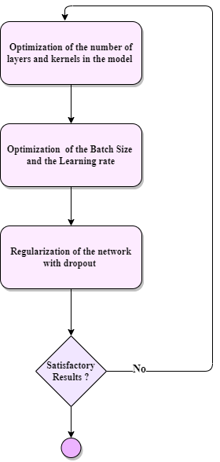
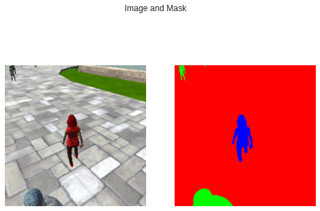
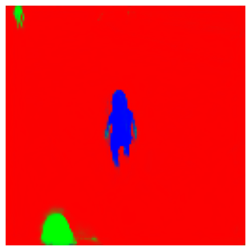

[image_0]: ./docs/misc/sim_screenshot.png
![alt text][image_0] 

# Deep Learning Project 

In this project, we will train a deep neural network to identify and track a target in simulation. So-called “follow me” applications like this are key to many fields of robotics and the very same techniques you apply here could be extended to scenarios like advanced cruise control in autonomous vehicles or human-robot collaboration in industry.


## 2 - Dependencies

You'll need Python 3 and Jupyter Notebooks installed to run this project.  The best way to get setup with these if you are not already is to use Anaconda 

you must install the following frameworks and packages on your system:
* Python 3.x
* Tensorflow 2.x

## 3 - Neural Network Training

Our network is a Fully Convolutional Network that gets images of shape (128,128,3) and outputs masks of the same shape. masks correspond to the background, people and the target person to follow.

### **Hyper Parameter Tuning**
 To tune the deep neural network hyperparameters we have set a workflow for tuning shown in the figure below.

<p align="center">


* We first started by fixing `epochs` , `batch size` and `learning rates` and tune the number of layers and number of kernels of the model. The more the validation loss the better.
* We tune the `epochs` , `batch size` and `learning rates` using a grid search to tune them all at once since they are dependant.
* We use regularization to reduce overfitting.

### **Network Architecture**

[image_2]: ./docs/misc/architecture.svg
![alt text][image_2] 

The network is composed of an `encoder` and a  `decoder`.
* **Encoder** : 3 Convolution blocks composed each of 3x3 kernels, max pooling and batch normalization.
* **Decoder** : 3 Deconvolution blocks composed each of 3x3 kernels, max upsampling and concatenation with encoder layers.

## 4 - Results
results of the network training are shown above and a crossentropy loss of `0.06` was achieved.

<p align="center">


and the predicted mask is shown above 

<p align="center">

 
 
## 5 - Launching the project and Training 
You can open this project in google colab 
and try running it and training the network

### **Collecting Training Data** 
A simple training dataset has been provided in this project's repository. This dataset will allow you to verify that your segmentation network is semi-functional. However, if your interested in improving your score,you may want to collect additional training data. To do it, please see the following steps.

The data directory is organized as follows:
```
data/runs - contains the results of prediction runs
data/train/images - contains images for the training set
data/train/masks - contains masked (labeled) images for the training set
data/validation/images - contains images for the validation set
data/validation/masks - contains masked (labeled) images for the validation set
data/weights - contains trained TensorFlow models

data/raw_sim_data/train/run1
data/raw_sim_data/validation/run1
```
### **Download the QuadSim binary**

To interface your neural net with the QuadSim simulator, you must use a version QuadSim that has been custom tailored for this project. The previous version that you might have used for the Controls lab will not work.

The simulator binary can be downloaded [here](https://github.com/udacity/RoboND-DeepLearning/releases/latest)


### **Training Set**
1. Run QuadSim
2. Click the `DL Training` button
3. Set patrol points, path points, and spawn points. **TODO** add link to data collection doc
3. With the simulator running, press "r" to begin recording.
4. In the file selection menu navigate to the `data/raw_sim_data/train/run1` directory
5. **optional** to speed up data collection, press "9" (1-9 will slow down collection speed)
6. When you have finished collecting data, hit "r" to stop recording.
7. To reset the simulator, hit "`<esc>`"
8. To collect multiple runs create directories `data/raw_sim_data/train/run2`, `data/raw_sim_data/train/run3` and repeat the above steps.

### **Validation Set** ###
To collect the validation set, repeat both sets of steps above, except using the directory `data/raw_sim_data/validation` instead rather than `data/raw_sim_data/train`.

### **Image Preprocessing** ###
Before the network is trained, the images first need to be undergo a preprocessing step. The preprocessing step transforms the depth masks from the sim, into binary masks suitable for training a neural network. It also converts the images from .png to .jpeg to create a reduced sized dataset, suitable for uploading to AWS. 
To run preprocessing:
```
$ python preprocess_ims.py
```

**Note** : modify the directories structure to match the one in the training file if you are generating data from simulation.


